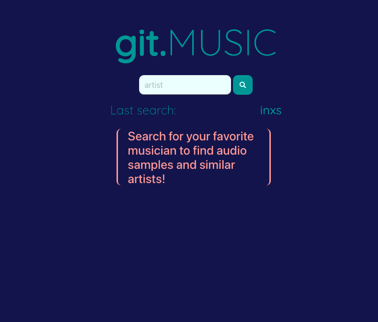
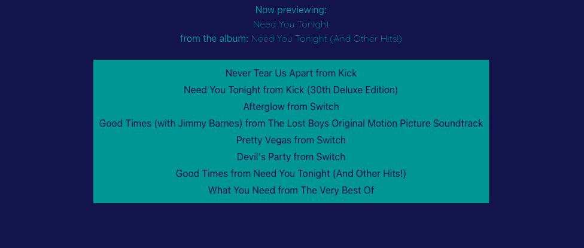

# gitMusic

## Table of Contents

-[Description](#description)

-[Technologies](#technologies)

## Title
git.MUSIC

-[Contributors](#collaboration)

-[Steps](#steps)

## Installation
To access the website go to https://matteothomas.github.io/git.Music/

The purpose of this app is to create a music application that allows users to search by artist and be able to listen to sample music from the artist’s album as well as be provided with a list of songs by the artist.

## Technologies

Express

APIs

## Installation

npm start

## Contributors

- @MelElson
- @RLacer
- @MatteoThomas
- @CoderLeE920

# Steps

Steps taken by user

- When the user inputs artist name they are given an image of the artist/band.
- The user is given music sample of the artist that they can listen to with built in player.
- The user is also presented with a list of songs from this artist.
- When the user searches another artist the current image and information is removed and the user is presented with the image and selection for new artist.
- When the user refreshes the page the previous search is shown

### Git Music

### Search

### List

