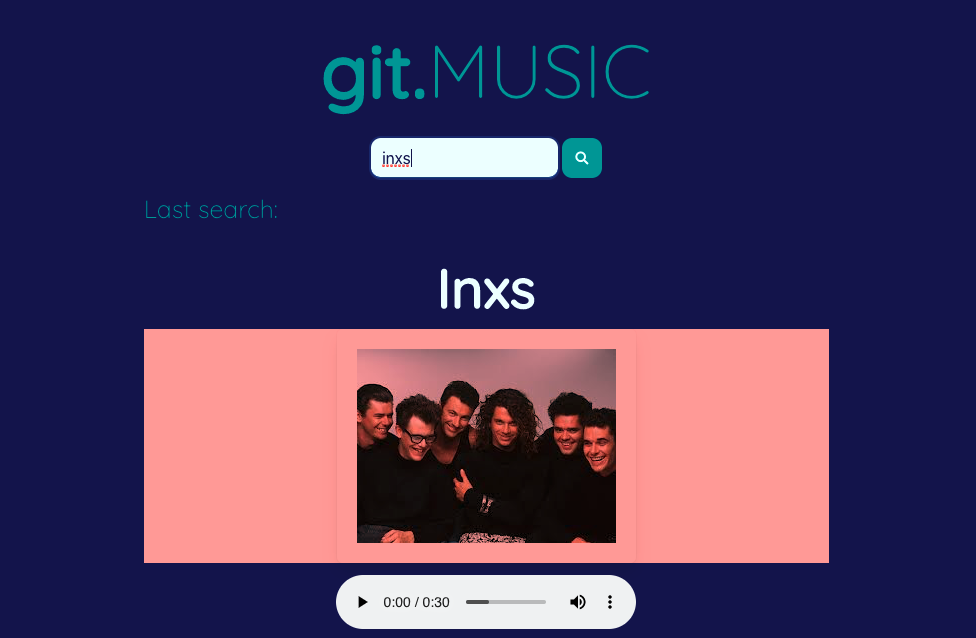

# Git-Music-Now-Project
Project 1 bootcamp

## Table of Contents
1. [Title](#title)
2. [General Info](#general-info)
3. [Technologies](#technologies)
4. [Installation](#installation)
5. [Collaboration](#collaboration)
6. [Steps](#Steps)

## Title
git.MUSIC

## General Info
The purpose of this app is to create a music application that allows users to search by artist and be able to listen to sample music from the artist’s album as well as be provided with a list of songs by the artist. 

## Technologies 
The site uses HTML, CSS and Javascript

## Installation
To access the website go to https://matteothomas.github.io/git.Music/

# Collaboration 
## Contributors 
* @MelElson 
* @RLacer
* @MatteoThomas
* @CoderLeE920

# Steps
Steps taken by user
* When the user inputs artist name they are given an image of the artist/band. 
* The user is given music sample of the artist that they can listen to with built in player. 
* The user is also presented with a list of songs from this artist.
* When the user searches another artist the current image and information is removed and the user is presented with the image and selection for new artist. 
* When the user refreshes the page the previous search is shown
	
  
### Git Music

### Search

### List

